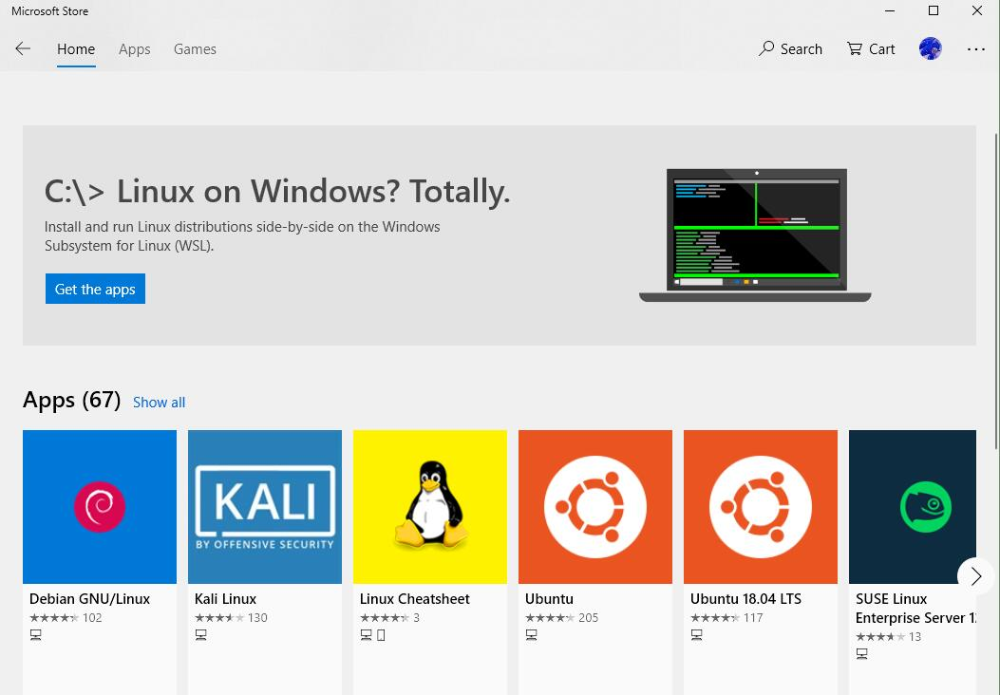

## 引言

做气象方面的研究很多时候需要Linux环境，然而很多时候Cygwin却很不好用。
如果装双系统来回切换，也是很麻烦。用虚拟机又担心性能损耗。

那么对于用Win10的同学来说，救星就是WSL(Windows Subsystem for Linux)。

> WSL(Windows Subsystem for Linux) 适用于Linux的Windows子系统

现在NCL官网也推荐win10用户使用WSL了。(实测安装NCL、Grads和WRF毫无问题，之前那篇WRF编译安装的文章就是基于WSL进行)

<!-- more -->

---

## 开始

### 安装
打开 `Microsoft Store` , 搜索 `Linux` ，我们选择`Ubuntu 18.04 LTS`。
如果没有微软账号，那么需要免费注册一个。然后开始等待下载安装。



WSL里的Ubuntu已经自带git,vim,ssh等常用工具。

安装完成后我们可以在开始菜单里找到`Ubuntu 18.04`。

但是现在我们还差一步

> `控制面板\所有控制面板项\程序和功能` 中选择 `启用或者关闭Windows功能`找到`适用于Linux的Windows子系统`并勾选,然后 `确定`选择`立即重新启动`

重启之后打开`Ubuntu 18.04`就可以使用了,根据提示输入用户名,两次输入密码(密码输入看不见)就可以进入Ubuntu了。

---

### 配置apt

由于自带的官方源在国内网络环境太慢，所以我们需要替换成国内镜像。
这里我们选择清华大学开源镜像站的源(清华源同时支持IPv4和IPv6，同时对教育网友好)。

```bash
sudo vim /etc/apt/sources.list
```

把里面的内容全部替换成

```
deb https://mirrors.tuna.tsinghua.edu.cn/ubuntu/ bionic main restricted universe multiverse
deb-src https://mirrors.tuna.tsinghua.edu.cn/ubuntu/ bionic main restricted universe multiverse
deb https://mirrors.tuna.tsinghua.edu.cn/ubuntu/ bionic-updates main restricted universe multiverse
deb-src https://mirrors.tuna.tsinghua.edu.cn/ubuntu/ bionic-updates main restricted universe multiverse
deb https://mirrors.tuna.tsinghua.edu.cn/ubuntu/ bionic-backports main restricted universe multiverse
deb-src https://mirrors.tuna.tsinghua.edu.cn/ubuntu/ bionic-backports main restricted universe multiverse
deb https://mirrors.tuna.tsinghua.edu.cn/ubuntu/ bionic-security main restricted universe multiverse
deb-src https://mirrors.tuna.tsinghua.edu.cn/ubuntu/ bionic-security main restricted universe multiverse
```

保存，运行`sudo apt update`更新源。

---

### 窗口配置

自带的大黑窗口太难看？ 没问题，我们来美化一下。

在Ubuntu窗口上方白色标题栏处点击鼠标右键，选择`属性`，在`字体选项卡`里我么将字体改为`黑体`，字号改为`17`。

在`颜色选项卡`里选择`屏幕背景`，我的设置是`红` `绿` `蓝`分别为`25`、`30`、`25`，不透明度`85%` 。

现在更好看了吧

---

### Xming

使用NCL和Grads的时候我们会需要用到X11，所以我们还需要安装Xming。 

使用X11绘图前需要先启动Xming

> 接下来就和普通ubuntu shell一样可以正常使用了