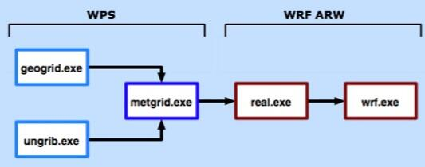

# Overview

## What is WRF?

* WRF: Weather Research and Forecasting Model
  * 用途：研究 and 预报
  * ARW（the Advanced Research WRF）
  * NMM（the Nonhydrostatic Mesoscale Model）
  * 由许多美国研究部门及大学的科学家公共参与进行开发研究的新一代中尺度预报模式和同化系统
  
## What is ARW and NMM?

两个动力内核：

* The Advanced Research WRF (ARW) 
* Nonhydrostatic Mesoscale Model (NMM)

动力内核包括： 

* 对流advection
* 气压梯度pressure-gradients
* 科氏力Coriolis
* 浮力buoyancy
* 滤波filters
* 耗散diffusion
* 时间积分time-stepping
* 地形跟随的垂直坐标系

> 物理过程，软件框架和部分的数据前处理和后处理都可以在两个动力内核之间共享。
<!-- more -->
## What can WRF be used for?

* ARW and NMM
  * 大气中的物理过程和参数化的研究
  * 个例研究
  * 实时数值天气预报
  * 资料同化
  * 动力过程和组织天气预报教学
  
* ARW only
  * 区域气候和季节时间尺度研究
  * 化学模式耦合
  * 全球模拟
  * 台风模拟
  * 多尺度上的理想实验 (e.g. 对流convection, 斜压波动baroclinic waves, 涡的模拟large eddy simulations)

  
  
# 配置文件

## WPS-namelist.wps

### &share
```
&share
 wrf_core = 'ARW', 
 max_dom = 1,  #总网格数(1是不嵌套)
 start_date = '2010-10-13_12:00:00','2010-10-13_12:00:00',
 end_date   = '2010-10-23_12:00:00','2010-10-23_12:00:00',
 interval_seconds = 21600
 io_form_geogrid = 2, 
/
```

*  `wrf_core`选择`ARW` 或`'NMM'`
* `max_dom` 总网格数，1为不嵌套
* `start_date` `end_date` 开始结束时间
* `interval_seconds` 输入资料的时间间隔，单位是秒
* `io_form_geogrid` geogrid生成的网格数据的格式
  * `1` binary 后缀：.int
  * `2` netcdf 后缀：.nc
  * `3` GRIB1 后缀：.gr1

### &geogrid
```
&geogrid
 parent_id         =   1,   1,
 parent_grid_ratio =   1,   3,
 i_parent_start    =   1,  31,
 j_parent_start    =   1,  17,
 e_we              =  74, 112,
 e_sn              =  61,  97,
 geog_data_res = 'gtopo_10m+usgs_10m+nesdis_greenfrac+10m','gtopo_2m+usgs_2m+nesdis_greenfrac+2m',
 dx = 30000,
 dy = 30000,
 map_proj = 'mercator',
 ref_lat   =  18.00,
 ref_lon   =  130.00,
 truelat1  =  18.00,
 stand_lon =  130.00,
 geog_data_path = '/home/sonic/WPS_GEOG/'
/
```

* `parent_id` 该网格的母网格的id，第一层网格的母网格是自身
* `parent_grid_ratio` 母网格和子网格水平分辨率的比
* `i_parent_start j_parent_start` 该层网格左下角的点在母网格中的位置
* `e_we e_sn ` 各层网格格点数  (嵌套网格格点-1)/3=整数
* `map_proj` 投影方式
  * `lambert` 兰伯特投影  光源放在地心，映像面是圆锥面  应用在中纬度地区形变比较小
    * `truelat1`
    * `truelat2` (可选)
    * `stand_lon`
  * `mercator` 墨卡托投影  低纬地区变形较小  投影光源放在地心，映像面为圆柱面
    * `truelat1`
  * `polar` 极射赤面投影  在高纬度地区变形较小  光源在南极，映像面是个平面
    * `truelat1`
    * `stand_lon`
  * `lat-lon` 等距圆柱投影  适用于全球模拟
    * `pole_lat`
    * `pole_lon`
    * `stand_lon`
* `ref_lat ref_lon` 母网格中心经纬度
* `truelat1` 标准纬度，随不同的投影方式有不同。在地图投影上，该纬度上没有距离形变。
选择地图投影时，要尽可能使得模拟的区域产生最小的形变。
* `stand_lon` 标准经度，一般和母网格中心经度一致
* `geog_data_path` 地形资料路径
* `geog_data_res` 静态地理数据

<table cellpadding="0" cellspacing="0" border="1" summary="静态地理数据库在geog_data_res中的设置方式"><tr><th>数据类型</th><th>可选库及精度</th><th>设置方式</th></tr><tr><td rowspan="2">HGT-M</td><td>gmted, 30s</td><td>default/gmted2010_30s</td></tr><tr><td>gtopo, 30s/2m/5m/10m</td><td>gtopo_30s/2m/5m/10m</td></tr><tr><td rowspan="4">LANDUSEF</td><td>modis 21 class, 30s</td><td>default/modis_lakes</td></tr><tr><td>modis 20 class, 15s/30s</td><td>modis_15s/30s</td></tr><tr><td>usgs 24 class, 30s/2m/5m/10m</td><td>usgs_30s/2m/5m/10m</td></tr><tr><td>usgs with lakes 30s</td><td>usgs_lakes</td></tr><tr><td>CON/VAR/OA1-4/OL1-4</td><td>10m/20m/30m/1deg/2deg</td><td>10m(default)/20m/30m/1deg/2deg</td></tr><tr><td>SOILCTOP/SOILCBOT</td><td>30s/2m/5m/10m</td><td>30s/2m(default)/5m/10m</td></tr><tr><td rowspan="2">GREENFRAC</td><td>modis</td><td>default/modis_fpar</td></tr><tr><td>nesdis</td><td>nesdis_greenfrac</td></tr><tr><td>VAR-SSO</td><td>30s/2m/5m/10m</td><td>30s/2m/5m/10m(default)</td></tr><tr><td colspan="3">其它库的调用均为default</tr></table>

* `geog_data_res`的设置规则
  * 不同精度的设定用“+”相连，例如：`geog_data_res="usgs_30s+default"`表示landuse用usgs库30s精度数据，其它库用default设置。
  * 从左往右搜索可用库。如上例，WPS先在GEOGRID.TBL中搜索usgs_30s所代表的数据库，然后在除LANDUSEF外其它数据类型中，搜索标识为default的数据库。 
如果WPS 没有在GEOGRID.TBL中搜索到usgs_30s字段，则LANDUSEF会用default库。再例如：`geog_data_res="10m+30s"`，WPS将调用10m地形重力波数
据、土壤类型数据和VAR-SSO数据，使得后面30s调用无效。若想调用30s土壤类型数据， `geog_data_res="30s"`。

### &ungrib
```
&ungrib
 out_format = 'WPS',
 prefix = 'FILE',
/
```
* `out_format` ungrib写出的中间文件的格式
  * `WPS`
  * `SI`
  * `MM5`
* `prefix` ungrib写出中间文件的前缀

### &metgrid
``` 
&metgrid
 fg_name = 'FILE'
 io_form_metgrid = 2,
/
```
* `fg_name` 用到的中间文件的前缀
* `io_form_metgrid` metgrid生成的网格数据的格式
  * `1` - binary 后缀：.int
  * `2` - netcdf 后缀：.nc
  * `3` - GRIB1 后缀：.gr1

## WRF-namelist.input

* `&time_control`：模拟总时长，输出的资料间隔等等
* `&domains`：描述网格有关
* `&physics`：选择物理过程
* `&fdda`：grid nudging，谱nudging，obs nudging
* `&dynamics`：动力参数
* `&bdy_control`：边界条件
*` &grib2`：grib2资料的处理
* `&namelist_quilt`：MPI的输入输出
* `&tc`：台风初始化

### &time_control
``` 
 &time_control
 run_days                            = 3,
 run_hours                           = 0,
 run_minutes                         = 0,
 run_seconds                         = 0,
 start_year                          = 2010, 2000, 2000,
 start_month                         = 10,   01,   01,
 start_day                           = 15,   24,   24,
 start_hour                          = 00,   12,   12,
 start_minute                        = 00,   00,   00,
 start_second                        = 00,   00,   00,
 end_year                            = 2010, 2000, 2000,
 end_month                           = 10,   01,   01,
 end_day                             = 18,   25,   25,
 end_hour                            = 00,   12,   12,
 end_minute                          = 00,   00,   00,
 end_second                          = 00,   00,   00,
 interval_seconds                    = 21600
 input_from_file                     = .true.,.true.,.true.,
 history_interval                    = 180,  60,   60,
 frames_per_outfile                  = 1000, 1000, 1000,
 restart                             = .false.,
 restart_interval                    = 5000,
 io_form_history                     = 2
 io_form_restart                     = 2
 io_form_input                       = 2
 io_form_boundary                    = 2
 debug_level                         = 0
 /
```

> ``` 
> run_days
> run_hours
> run_minutes
> run_seconds
> ```
模拟总时长

> ``` 
> start_year
> start_month
> start_day
> start_hour
> start_minute
> start_second
> end_year
> end_month
> end_day
> end_hour
> end_minute
> end_second
> ```
起止时间

（年，月，日，分，秒）
每一列代表一层网格

* `interval_seconds` 输入的met资料的时间间隔，生成的边界场的时间间隔（秒）
* `history_interval` 输出数据的时间间隔（分钟）
* `frames_per_outfile` 每个wrfout里面记录多少个时次的数据
* `input_from_file` 嵌套网格是否有初始场
* `restart` 断点启动的设置
  * 正常运行时 `restart=.false.`
  * 需要断点启动时  `restart=.true.`
* `restart_interval` 生成断点文件的时间间隔（分钟），表示每多少分钟生成一个断点文件。

> ```
> io_form_history
> io_form_restart
> io_form_input
> io_form_boundary
> ```
各种数据的IO格式 ：2表示netcdf，其他同上。

### &domains
``` 
&domains
 time_step                           = 180,
 time_step_fract_num                 = 0,
 time_step_fract_den                 = 1,
 max_dom                             = 1,
 e_we                                = 74,    112,   94,
 e_sn                                = 61,    97,    91,
 e_vert                              = 30,    30,    30,
 p_top_requested                     = 5000,
 num_metgrid_levels                  = 27,
 num_metgrid_soil_levels             = 4,
 dx                                  = 30000, 10000,  3333.33,
 dy                                  = 30000, 10000,  3333.33,
 grid_id                             = 1,     2,     3,
 parent_id                           = 0,     1,     2,
 i_parent_start                      = 1,     31,    30,
 j_parent_start                      = 1,     17,    30,
 parent_grid_ratio                   = 1,     3,     3,
 parent_time_step_ratio              = 1,     3,     3,
 feedback                            = 1,
 smooth_option                       = 0
 /
```
* `time_step` 积分步长，≤6*dx（最外层网格）
  * `time_step_fract_num` 分子
  * `time_step_fract_den` 分母
* `max_dom ` 总网格数
* `e_we` 东西方向的格点数
* `e_sn` 南北方向的格点数
* `e_vert` 垂直层数
* `p_top_requested`  对流层顶高度（Pa）
* `num_metgrid_levels`  WPS得到的met数据的垂直层数
* `num_metgrid_soil_levels` WPS得到的met数据的土壤层数
* `dx` 每一层网格的水平分辨率(m)
* `dy` 每一层网格的水平分辨率(m)
* `feedback` 是否反馈 0 or 1
* `smooth_option` 最外层网格是否平滑
  * `0` - no smoothing
  * `1` - 1-2-1 平滑，只用于feedback=1
  * `2` - (default)smoothing-desmoothing，只用于feedback=1

### &physics
``` 
 &physics
 physics_suite                       = 'CONUS'
 radt                                = 30,    30,    30,
 bldt                                = 0,     0,     0,
 cudt                                = 5,     5,     5,
 icloud                              = 1,
 num_soil_layers                     = 4,
 num_land_cat                        = 24,
 sf_urban_physics                    = 0,     0,     0,
 /
```

* `radt` 调用辐射方案的时间(minutes) 建议和最外层网格的水平分辨率的km数一致，1分钟/1km，且每层网格使用一样的数值
* `bldt` 调用边界层方案的时间(minutes)
* `cudt` 调用积云参数化方案的时间(minutes)
* `icloud` 是否考虑辐射光学厚度中的云效应 1 or 0
* `num_land_cat` 输入数据陆地类型数
  * `24` - for USGS (default)
  * `20` - for MODIS
  * `28` - for USGS if including lake category
  * `21` - for MODIS if including lake category (default since 3.8)
  * `40` - for NCLD
  
### &bdy_control
``` 
&bdy_control
 spec_bdy_width                      = 5,
 spec_zone                           = 1,
 relax_zone                          = 4,
 specified                           = .true., .false.,.false.,
 nested                              = .false., .true., .true.,
 /
```
* `spec_bdy_width` 固定边界的宽度
  * spec_bdy_width = spec_zone + relax_zone
* `spec_zone` 固定区的格点数，不能修改
* `relax_zone` 缓冲区的格点数
* `specified` 是否使用固定边界（最外层网格有效）
* `nested` 是否是嵌套网格

