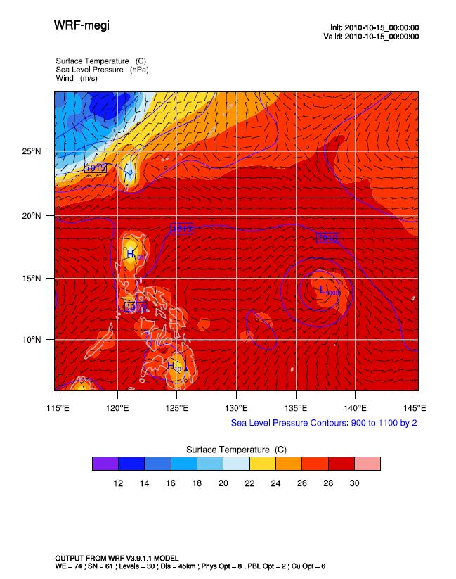
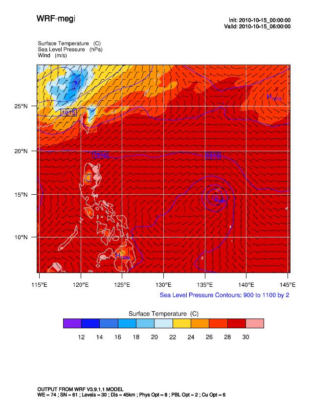

## 环境

* WRFV3.9.1.1 smpar单机并行
* WPSV3.9.1 单机串行

<!-- more -->

## 开始

### 文件准备

将

* geog_minimum.tar.bz2
* orogwd_10m.tar.bz2
* orogwd_10m.tar.bz2

三个文件复制到`/home/sonic/WPS_GEOG/`中（先创建文件夹`WPS_GEOG`）（该路径为地形数据文件路径，需要在`namelist.wps`中设置），然后采用下述命令解压：

```bash
tar -jxvf geog_minimum.tar.bz2
tar -jxvf orogwd_10m.tar.bz2
tar -jxvf orogwd_10m.tar.bz2
```

然后选一次个例数据(这里我们选择megi)，将个例文件夹中的`fnl_*`文件复制或移动到`/home/sonic/data/mega/`文件夹中。

> 超强台风鲇鱼(Megi编号1013)；2010年太平洋台风季最强风暴。该台风产生于2010年10月11日，18日登陆菲律宾吕宋岛，23日登陆中国福建，24日消散。

---

### 运行WPS

现在切换到WPS目录

```bash
vim namelist.wps
```
配置`namelist.wps`文件

将`start_date` `end_date` 按需修改

`geog_data_path`项改为`'/home/sonic/WPS_GEOG/'`

> 注意： WPS从V3.8开始，将GEOG地形数据场插值数据源换成了
`30-arc-second USGS GMTED2010` `MODIS FPAR` `21-class MODIS`。
如果需要使用V3.7以及之前的地形文件数据，需要把`namelist.wps`文件中的
`geog_data_res`选项设置为` 'gtopo_10m+usgs_10m+nesdis_greenfrac+10m','gtopo_2m+usgs_2m+nesdis_greenfrac+2m',`。
之前版本的`geog_data_res='10m','2m',`不再可用。

这里我们使用的地形数据是老版本的，所以需要把`geog_data_res`设置为` 'gtopo_10m+usgs_10m+nesdis_greenfrac+10m','gtopo_2m+usgs_2m+nesdis_greenfrac+2m',`。

```bash
./geogrid.exe
```

处理地形资料和网格数据，生成`geo_em.d01(d02, d03,,,).nc`文件。

```bash
ln -sf ungrib/Variable_Tables/Vtable.GFS Vtable
```
链接我们需要的Vtable

```bash
./link_grib.csh   /home/sonic/data/mega/fnl_*
```
链接外部数据

```bash
./ungrib.exe
```
解码GRIB资料，得到气象要素场。生成`FILE*`为前缀的中间文件。

```bash
./metgrid.exe 
```
将气象要素场水平插值到地形资料上。生成类似`met_em.d01.*`文件。

---
### 运行WRF

切换到`WRFV3/test/em_real`目录

```bash
ln -sf ../../../WPS/met_em*  .
```
将资料文件链接过来。

修改`namelist.input`，按需配置运行时间 起始时间 结束时间。

将`gwd_opt` 配置成`0`，`num_land_cat`配置成`24`。

```bash
./real.exe
```

生成`wrfbdy_d01*`,`wrfinput_d01*`文件。

```bash
./wrf.exe
```

即可看到运行状态。运行完成之后生成`wrfout***`文件。

到此就成功运行了WRF和WPS。

---

## 绘图

使用ncl官网提供的绘图脚本

```ncl

;   Example script to produce plots for a WRF real-data run,
;   with the ARW coordinate dynamics option.

load "$NCARG_ROOT/lib/ncarg/nclscripts/csm/gsn_code.ncl"
load "$NCARG_ROOT/lib/ncarg/nclscripts/wrf/WRFUserARW.ncl"
;load "./WRFUserARW.ncl"

begin
;
; The WRF ARW input file.  
; This needs to have a ".nc" appended, so just do it.
  a = addfile("./wrfout_d01_2010-10-15_000000.nc","r")

; We generate plots, but what kind do we prefer?
  type = "x11"
; type = "pdf"
; type = "ps"
; type = "ncgm"
  wks = gsn_open_wks(type,"plt_Surface1")

; Set some basic resources
  res = True
  res@MainTitle                   = "WRF-megi"

  pltres = True
  mpres = True


;;;;;;;;;;;;;;;;;;;;;;;;;;;;;;;;;;;;;;;;;;;;;;;;;;;;;;;;;;;;;;;;
;;;;;;;;;;;;;;;;;;;;;;;;;;;;;;;;;;;;;;;;;;;;;;;;;;;;;;;;;;;;;;;;

; What times and how many time steps are in the data set?
  times = wrf_user_getvar(a,"times",-1)  ; get all times in the file
  ntimes = dimsizes(times)         ; number of times in the file

;;;;;;;;;;;;;;;;;;;;;;;;;;;;;;;;;;;;;;;;;;;;;;;;;;;;;;;;;;;;;;;;

  do it = 0,ntimes-1,2             ; TIME LOOP

    print("Working on time: " + times(it) )
    res@TimeLabel = times(it)   ; Set Valid time to use on plots


;;;;;;;;;;;;;;;;;;;;;;;;;;;;;;;;;;;;;;;;;;;;;;;;;;;;;;;;;;;;;;;;
; First get the variables we will need        

    slp = wrf_user_getvar(a,"slp",it)    ; slp
      wrf_smooth_2d( slp, 3 )            ; smooth slp
    tc = wrf_user_getvar(a,"tc",it)      ; 3D tc 
    td = wrf_user_getvar(a,"td",it)      ; 3D td 
    u  = wrf_user_getvar(a,"ua",it)      ; 3D U at mass points
    v  = wrf_user_getvar(a,"va",it)      ; 3D V at mass points
    td2 =  wrf_user_getvar(a,"td2",it)   ; Td2 in C
    tc2 = wrf_user_getvar(a,"T2",it)     ; T2 in Kelvin
       tc2 = tc2-273.16                  ; T2 in C
    u10 = wrf_user_getvar(a,"U10",it)    ; u at 10 m, mass point
    v10 = wrf_user_getvar(a,"V10",it)    ; v at 10 m, mass point

     tc2@description = "Surface Temperature"
     tc2@units = "C"

     td2@description = "Surface Dew Point Temp" 
     td2@units = "C"

     u10@units = "m/s"
     v10@units = "m/s"

;;;;;;;;;;;;;;;;;;;;;;;;;;;;;;;;;;;;;;;;;;;;;;;;;;;;;;;;;;;;;;;;

    ; Plotting options for T                
      opts = res                         
      opts@cnFillOn = True  
      opts@ContourParameters = (/ 12., 30., 2./)
      opts@gsnSpreadColorEnd = -3  ; End third from the last color in color map
      contour_tc = wrf_contour(a,wks,tc2,opts)
      delete(opts)


    ; Plotting options for Td
;      opts = res         
;      opts@cnFillOn = True 
;      opts@cnLinesOn = True
;      opts@cnLineLabelsOn = True
;      opts@ContourParameters = (/ 10., 30., 2./) 
;      opts@cnLineLabelBackgroundColor = -1
;      opts@gsnSpreadColorEnd = -3  ; End third from the last color in color map
;      contour_td = wrf_contour(a,wks,td2,opts)
;      delete(opts)


    ; Plotting options for SLP                     
      opts = res         
      opts@cnLineColor = "Blue"
      opts@cnHighLabelsOn = True
      opts@cnLowLabelsOn = True
      opts@ContourParameters = (/ 900., 1100., 2.5 /)
      opts@cnLineLabelBackgroundColor = -1
      opts@gsnContourLineThicknessesScale = 2.0
      contour_psl = wrf_contour(a,wks,slp,opts)
      delete(opts)

    ; Plotting options for Wind Vectors                 
      opts = res         
      opts@FieldTitle = "Wind"       ; overwrite Field Title
      opts@NumVectors = 47           ; density of wind barbs
      vector = wrf_vector(a,wks,u10,v10,opts)
      delete(opts)
  

    ; MAKE PLOTS                                       
      plot = wrf_map_overlays(a,wks,(/contour_tc,contour_psl,vector/),pltres,mpres)
;      plot = wrf_map_overlays(a,wks,(/contour_td,vector/),pltres,mpres)

;;;;;;;;;;;;;;;;;;;;;;;;;;;;;;;;;;;;;;;;;;;;;;;;;;;;;;;;;;;;;;;;

  end do        ; END OF TIME LOOP

end
```

最后可得到结果





